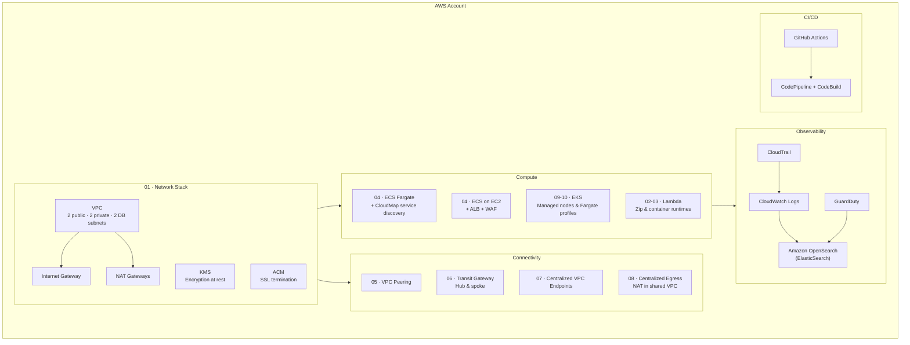

# DevOps / Cloud Engineering Portfolio

A collection of infrastructure-as-code projects covering AWS networking, compute, observability, and CI/CD patterns. All proprietary details have been removed; the focus is on architecture and reusable Terraform modules.

---

## High-Level Architecture Overview



---

## Tech Stack

| Layer | Technology |
|---|---|
| Infrastructure as Code | Terraform / OpenTofu |
| Cloud provider | AWS |
| Networking | VPC, Subnets, Route Tables, NACL, Security Groups, Transit Gateway, VPC Peering, VPC Endpoints, NAT Gateway, Internet Gateway |
| DNS & certificates | Route 53, ACM |
| Compute | ECS Fargate, ECS on EC2, EKS (managed nodes + Fargate), Lambda (zip & container) |
| Service discovery | AWS Cloud Map |
| Load balancing | ALB, NLB, AWS Load Balancer Controller |
| Security | KMS, IAM, GuardDuty, WAF, AWS Secrets Manager, Session Manager |
| Observability | CloudWatch Logs, Amazon OpenSearch, CloudTrail |
| CI/CD | GitHub Actions, AWS CodePipeline, CodeBuild |
| Container registry | Amazon ECR |
| Storage | S3, EFS, EBS |
| State management | S3 (remote state) + DynamoDB (state locking) |
| Language | Python (Lambda functions), HCL (Terraform), Bash |

---

## Project Index

| # | Folder | Description |
|---|---|---|
| 00 | `00-infra-backend` | S3 bucket and DynamoDB table for Terraform remote state |
| 01 | `01-network-stack` | Multi-AZ VPC with public, private, and DB subnets; KMS, ACM, Route 53 |
| 02 | `02-lambda` | Lambda functions (zip) — basic and VPC-attached variants |
| 03 | `03-lambda-container` | Lambda functions packaged as container images |
| 04a | `04-ecs` | ECS Fargate cluster with ALB, WAF, SNS, and Route 53 |
| 04b | `04-ecs-cloudmap` | ECS Fargate with Cloud Map service discovery |
| 04c | `04-ecs-ec2` | ECS on EC2 with Launch Template, ASG, ALB, and WAF |
| 05 | `05-vpc-peering` | Direct VPC peering between two VPCs |
| 06 | `06-vpc-peering-tgw` | Hub-and-spoke connectivity via Transit Gateway |
| 07 | `07-centralized-vpce` | Shared VPC Endpoints consumed by spoke VPCs through TGW |
| 08 | `08-centralized-egress` | Centralized outbound internet via a shared NAT VPC and TGW |
| 09 | `09-eks` | EKS cluster with managed node groups |
| 10 | `10-eks-fargate` | EKS with Fargate profiles, AWS Load Balancer Controller, and app manifests |

Reusable modules live under `modules/` (vpc, lambda, lambda-container, eks, cicd-pipeline, s3).

---

## Prerequisites

- AWS CLI configured (`aws configure` or environment variables)
- Terraform >= 1.5 **or** OpenTofu >= 1.6
- Sufficient IAM permissions to create the resources in each stack

---

## Run Instructions

### Step 1 — Bootstrap the Terraform backend (run once)

```sh
cd 00-infra-backend
terraform init
terraform plan
terraform apply -auto-approve
```

Note the `s3_bucket_name` and `dynamodb_table_name` outputs — you will need them in every other stack's `provider.tf`.

```hcl
# provider.tf backend block (replace placeholders)
backend "s3" {
  bucket         = "<s3_bucket_name>"
  key            = "dev/<stack-name>.tfstate"
  region         = "<aws-region>"
  dynamodb_table = "<dynamodb_table_name>"
}
```

### Step 2 — Deploy any stack

```sh
cd <stack-folder>        # e.g. 01-network-stack
terraform init
terraform plan
terraform apply -auto-approve
```

Using OpenTofu instead:

```sh
tofu init
tofu plan
tofu apply -auto-approve
```

### Recommended deployment order

```
00-infra-backend  →  01-network-stack  →  07-centralized-vpce
                                       →  08-centralized-egress
                                       →  04-ecs / 04-ecs-ec2 / 04-ecs-cloudmap
                                       →  09-eks  →  10-eks-fargate
```

Lambda stacks (`02`, `03`) and VPC peering stacks (`05`, `06`) are independent of each other but depend on an existing VPC.

### Tear down

```sh
terraform destroy -auto-approve
```

Always destroy in reverse deployment order to avoid dependency errors.

---

## CI/CD Workflows

Two GitHub Actions workflows are included under `.github/workflows/`:

| Workflow | Trigger | What it does |
|---|---|---|
| `create-backend-tf.yml` | Push / PR | Provisions the S3 + DynamoDB backend |
| `setup-network-stack.yml` | Push / PR | Plans and applies the network stack |
